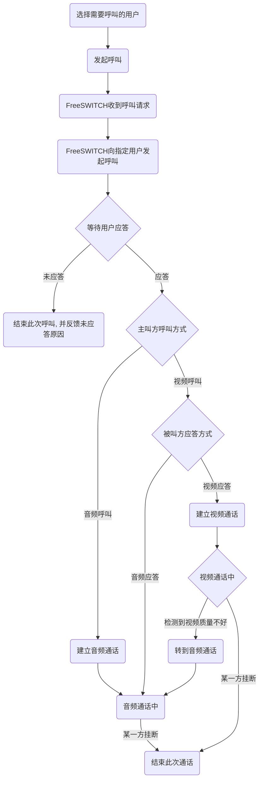
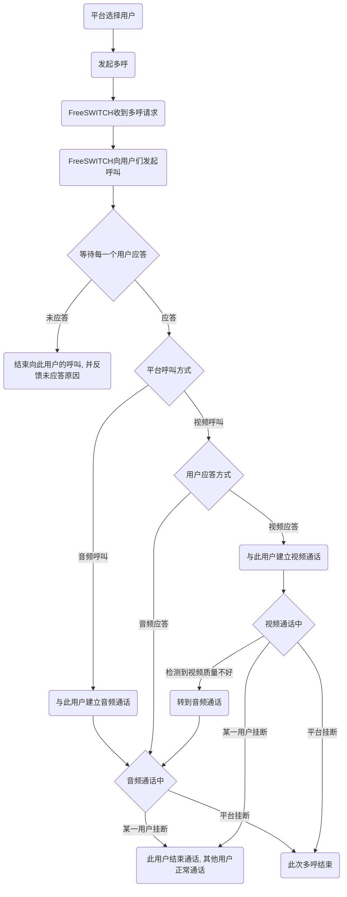
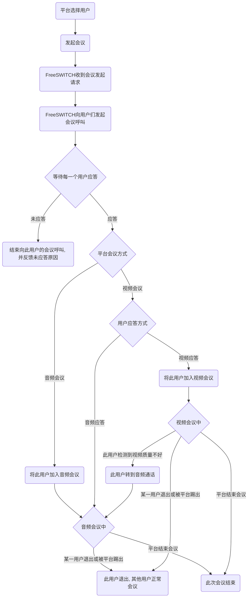

* 音频/视频单呼

```mermaid
graph TB
A1(选择需要呼叫的用户)-->A2(发起呼叫)-->A3(FreeSWITCH收到呼叫请求)-->A4(FreeSWITCH向指定用户发起呼叫)-->A5{等待用户应答}

A5--未应答-->B1(结束此次呼叫, 并反馈未应答原因)
A5--应答-->A6{主叫方呼叫方式}

A6--视频呼叫-->A7{被叫方应答方式}
A6--音频呼叫-->C1(建立音频通话)-->C2(音频通话中)--某一方挂断-->C3(结束此次通话)

A7--视频应答-->A8(建立视频通话)-->A9{视频通话中}
A7--音频应答-->C2

A9--某一方挂断-->C3
A9--检测到视频质量不好-->A10(转到音频通话)-->C2
```

* 音频/视频多呼

```mermaid
graph TB
A1(平台选择用户)-->A2(发起多呼)-->A3(FreeSWITCH收到多呼请求)-->A4(FreeSWITCH向用户们发起呼叫)-->A5{等待每一个用户应答}

A5--未应答-->B1(结束向此用户的呼叫, 并反馈未应答原因)
A5--应答-->A6{平台呼叫方式}

A6--视频呼叫-->A7{用户应答方式}
A6--音频呼叫-->C1(与此用户建立音频通话)-->C2{音频通话中}

A7--视频应答-->A8(与此用户建立视频通话)-->A9{视频通话中}
A7--音频应答-->C2

C2--某一用户挂断-->C3(此用户结束通话, 其他用户正常通话)
C2--平台挂断-->D1(此次多呼结束)

A9--某一用户挂断-->C3
A9--平台挂断-->D1
A9--检测到视频质量不好-->A10(转到音频通话)-->C2
```

* 音频/视频会议

```mermaid
graph TB
A1(平台选择用户)-->A2(发起会议)-->A3(FreeSWITCH收到会议发起请求)-->A4(FreeSWITCH向用户们发起会议呼叫)-->A5{等待每一个用户应答}

A5--未应答-->B1(结束向此用户的会议呼叫, 并反馈未应答原因)
A5--应答-->A6{平台会议方式}

A6--视频会议-->A7{用户应答方式}
A6--音频会议-->C1(将此用户加入音频会议)-->C2{音频会议中}

A7--视频应答-->A8(将此用户加入视频会议)-->A9{视频会议中}
A7--音频应答-->C2

C2--某一用户退出或被平台踢出-->C3(此用户退出, 其他用户正常会议)
C2--平台结束会议-->D1(此次会议结束)

A9--某一用户退出或被平台踢出-->C3
A9--平台结束会议-->D1
A9--此用户检测到视频质量不好-->A10(此用户转到音频通话)-->C2
```